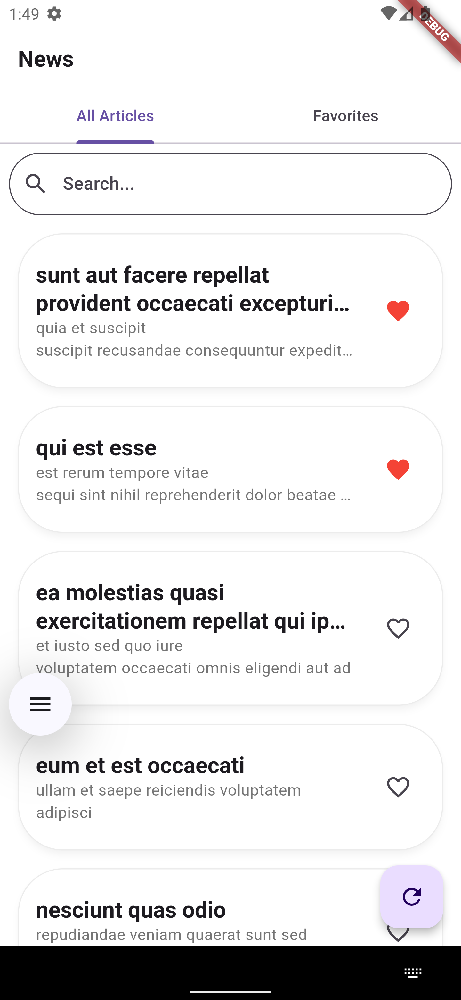
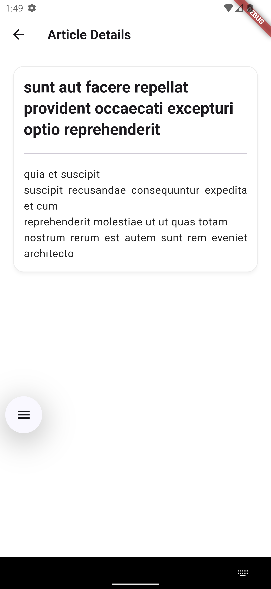
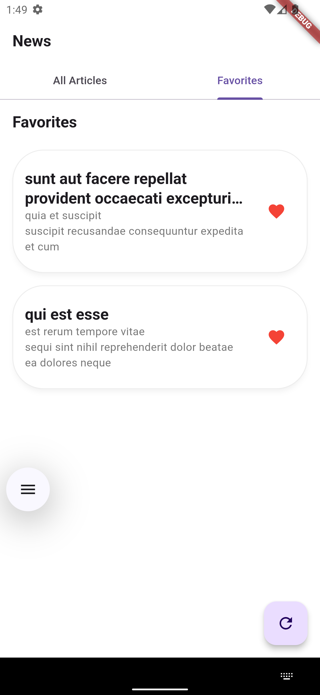

# newsapp


A Flutter application that fetches and displays a list of articles from a public API. The app allows users to search articles, view details, and mark favorites with persistent storage.

## Features

- 📰 List of articles with title and summary
- 🔍 Search functionality by article title and body
- 📄 Article detail view with dynamic, responsive card UI
- ❤️ Favorite/unfavorite articles with persistent local storage
- 📱 Responsive layout across various screen sizes

## Setup Instructions

### 1. Clone the repository

**Step 1:**

Download or clone this repo by using the link below:

```
https://github.com/zubairehman/flutter-boilerplate-project.git
```

**Step 2:**

Go to project root and execute the following command in console to get the required dependencies:

```
flutter pub get 
```

```
flutter run
```


## Tech Stack
- Flutter SDK: 3.24.4 Stable 
- State Management: Bloc
- HTTP Client: http
- Persistence: shared_preferences


## State Management Explanation

The application uses `flutter_bloc` for structured and scalable state management. Events are dispatched to respective BLoC classes (e.g., `ArticleBloc`, `FavoriteBloc`), which handle business logic like fetching articles or toggling favorites, and emit new states accordingly. The UI listens to these state changes using `BlocBuilder` or `BlocConsumer`, ensuring a clean separation of concerns between logic and presentation.


## Known Issues / Limitations

- Currently, articles are fetched from a mock or static API and may not support pagination.
- The favorite toggle is functional but does not persist across app restarts (no local storage yet).
- Some UI elements (like Article Detail View) could be improved for better responsiveness on tablets or large screens.
- Error handling for network failures and loading states can be enhanced further.


## Screenshots (Optional)

| Home Screen | Article Detail                            | Favorites Screen                              |
|-------------|-------------------------------------------|-----------------------------------------------|
|  |  |  |